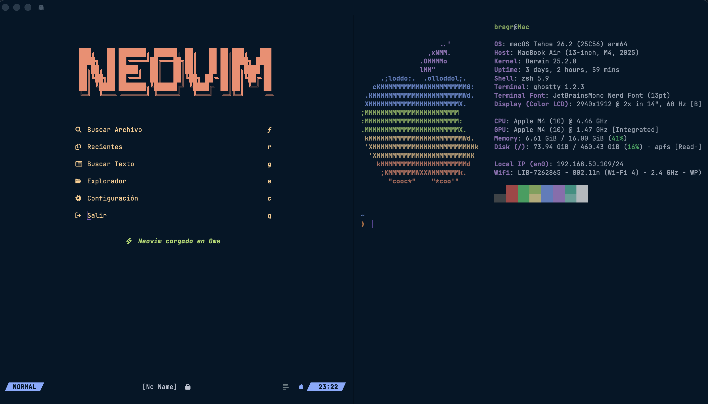

# My Personal Neovim Config


My personal Neovim configuration focused on speed, efficiency, and a clean interface for daily development. Built entirely in Lua and managed with `lazy.nvim`.

## ✨ Core Features & Plugins

*   **Plugin Management**: `lazy.nvim`
*   **Keymaps**: Custom, intuitive keybindings (`lua/core/keymaps.lua`).
*   **Options**: Sensible Neovim defaults (`lua/core/options.lua`).
*   **Theme**: `Night Owl` (`lua/core/theme.lua`, `lua/plugins/night-owl.lua`).
*   **Dashboard**: `Alpha`
*   **Statusline**: `Lualine`
*   **File Explorer**: `Neo-tree`
*   **Fuzzy Finder**: `Telescope`

## 🚀 Installation

### Prerequisites

*   Neovim (v0.9.0+)
*   `git`
*   A Nerd Font

### Steps

1.  **Clone the config:**
    ```bash
    git clone https://github.com/your_username/your_dotfiles_repo.git ~/.config/nvim
    ```
    (Remember to replace the repo URL with your own)

2.  **Launch Neovim:**
    ```bash
    nvim
    ```
    Plugins will install automatically on first launch.

## 💡 Usage

*   **Leader Key**: `<Space>`
*   Explore `lua/core/keymaps.lua` for specific keybindings.
