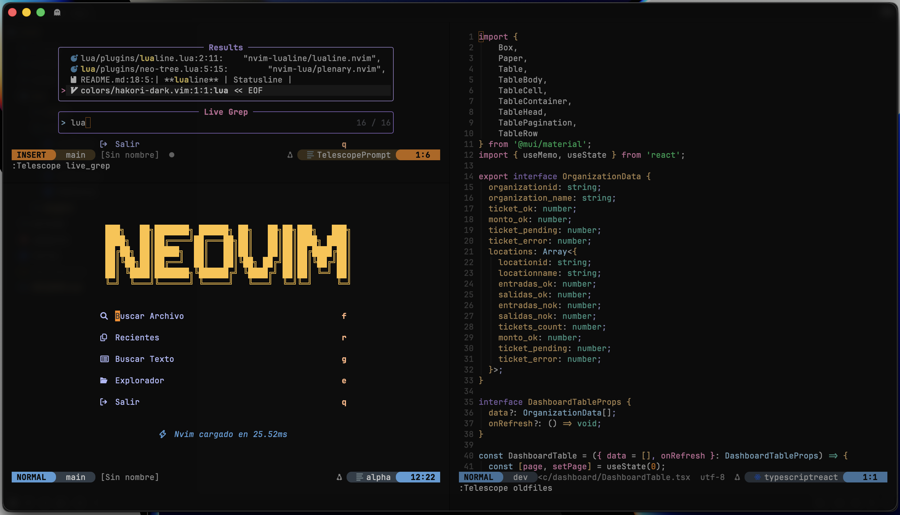

# Neovim Config

Configuración minimalista de Neovim para edición básica de archivos.

**Plugin Manager:** Lazy.nvim
**Tema:** Hakori Dark (custom)

## Plugins

| Plugin | Función |
|--------|---------|
| **telescope** | Fuzzy finder |
| **neo-tree** | File explorer |
| **lualine** | Statusline |
| **gitsigns** | Git integration |
| **flash** | Quick navigation |
| **alpha** | Dashboard |
| **autopairs** | Auto close brackets |
| **comment** | Toggle comments |
| **colorizer** | Color preview |
| **indent-blankline** | Indent guides |

## Keymaps

**Leader:** `<Space>`

### Navegación

| Atajo | Acción |
|-------|--------|
| `s` + `2 letras` | Saltar a cualquier parte (Flash) |
| `Ctrl-d` / `Ctrl-u` | Bajar/subir media pantalla |
| `{` / `}` | Moverse entre bloques |
| `gcc` | Toggle comment |
| `<leader>e` | Toggle file explorer |
| `<leader>ff` | Buscar archivos (Telescope) |
| `<leader>fg` | Buscar en archivos (Grep) |
| `<leader>aa` | Dashboard |

## Instalación

```bash
git clone https://github.com/bragr05/nvim-config ~/.config/nvim
nvim
```
