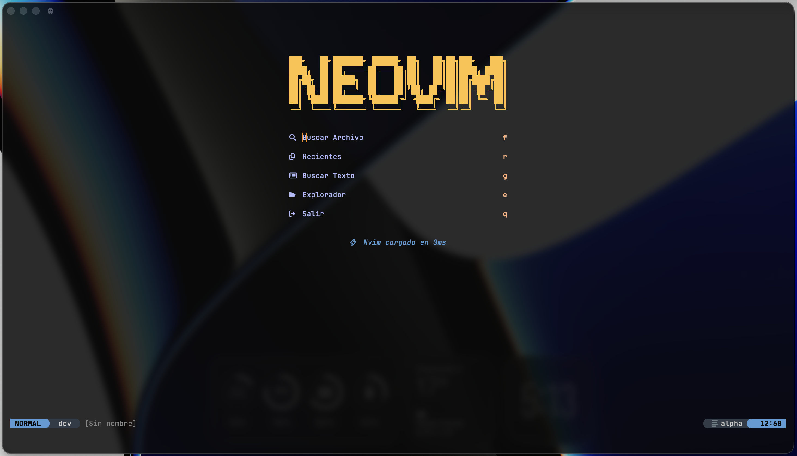
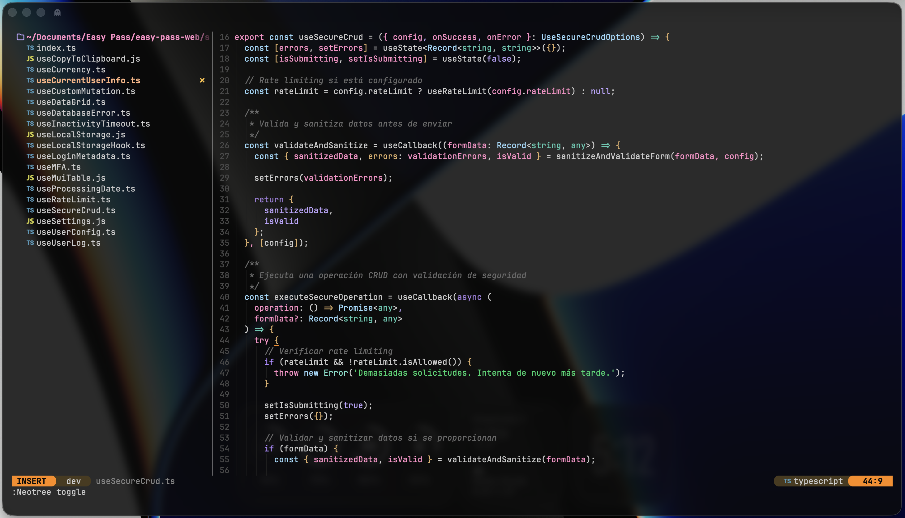

 

# Neovim Config

Configuración moderna de Neovim con LSP, autocompletado y soporte para desarrollo web.

## Stack

**LSP Servers:** `lua_ls` · `ts_ls` · `sqlls`
**Plugin Manager:** Lazy.nvim
**Tema:** Hakori Dark

## Plugins

| Plugin | Función |
|--------|---------|
| **telescope** | Fuzzy finder |
| **nvim-cmp** | Autocompletado |
| **treesitter** | Syntax highlighting |
| **mason** | LSP installer |
| **neo-tree** | File explorer |
| **lualine** | Statusline |
| **gitsigns** | Git integration |
| **trouble** | Diagnostics panel |
| **flash** | Quick navigation |

## Keymaps

**Leader:** `<Space>`

### Día a Día

| Atajo | Acción |
|-------|--------|
| `s` + `2 letras` | Saltar a cualquier parte |
| `S` | Saltar por funciones/bloques |
| `Ctrl-d` / `Ctrl-u` | Bajar/subir media pantalla |
| `{` / `}` | Moverse entre bloques |
| `gcc` | Toggle comment |
| `<leader>e` | Toggle file explorer |

### LSP & Navegación

| Atajo | Acción |
|-------|--------|
| `gd` | Go to definition |
| `K` | Hover docs |
| `<leader>ca` | Code actions |
| `<leader>rn` | Rename symbol |
| `[d` / `]d` | Navigate diagnostics |
| `<leader>aa` | Dashboard |

## Instalación

```bash
git clone https://github.com/tu-usuario/nvim-config ~/.config/nvim
nvim
```

Ejecuta `:Mason` para verificar LSP servers instalados.
